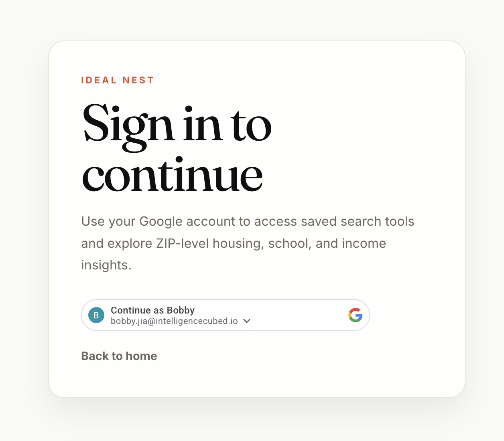

# CIS 5500 Final Project — Housing & ZIP Search

Web application for **CIS 5500 (Spring 2026)**: explore U.S. ZIP–level housing and neighborhood data with a **FastAPI** backend (PostgreSQL on AWS RDS) and a **React (Vite)** frontend (PrimeReact).

**Live site**: https://cis-5500-final-project-group22.vercel.app/
**NOTICE**: You have to sign in with your Google account.




- **Flexible search** (`/`): filter ZIP areas with sliders and text inputs (debounced requests to the API).
- **Recommended searches** (`/recommended`): the four Milestone 3 preset queries with preset-specific parameters only.
- **ZIP detail** (`/zip/:zipCode`): drill-down for a single ZIP code.

SQL for Milestone 3 lives in `backend/app/sql/milestone3.py` and is called from `backend/app/routers/zip_areas.py`. API routes are under the `/api` prefix; interactive docs are available when the backend is running.

---

## Prerequisites

- **Python** 3.10+ (3.11+ recommended)
- **Node.js** 18+ and **npm**
- **Database access**: a valid `DATABASE_URL` for the team’s PostgreSQL instance (password from your group; never commit secrets)

---

## Clone the repository

```bash
git clone <repository-url>
cd CIS-5500-FinalProject-Group22
```

---

## Backend setup

```bash
cd backend
python3 -m venv .venv
source .venv/bin/activate          # Windows: .venv\Scripts\activate
pip install -r requirements.txt
cp .env.example .env
```

Edit `backend/.env`:

- Set **`DATABASE_URL`** to your PostgreSQL connection string (replace the placeholder password in `.env.example`).
- **`CORS_ORIGINS`** should include the frontend dev origin (default includes `http://localhost:5173` and `http://127.0.0.1:5173`). Add more origins comma-separated if needed (e.g. a deployed site).

### Run the API

From `backend/` with the virtual environment activated:

```bash
uvicorn app.main:app --reload --port 8000
```

- Base URL: **http://127.0.0.1:8000**
- Health: **GET** `/health`
- Swagger UI: **http://127.0.0.1:8000/docs**

---

## Frontend setup

In a **second** terminal (keep the backend running on port 8000):

```bash
cd frontend
npm install
npm run dev
```

- App URL: **http://localhost:5173** (Vite default)
- Requests to **`/api/*`** are proxied to **http://127.0.0.1:8000** (see `frontend/vite.config.js`).

### Production build (optional)

```bash
cd frontend
npm run build
```

---

## Repository layout

| Path | Description |
|------|-------------|
| **`backend/`** | FastAPI application: routers (`app/routers/`), Pydantic schemas, SQLAlchemy DB session (`app/db.py`), environment config (`app/config.py`), and Milestone SQL (`app/sql/milestone3.py`). See **`backend/README.md`** for API-oriented notes. |
| **`frontend/`** | React + Vite SPA (PrimeReact UI): pages, hooks, API helpers, and Vite proxy for `/api`. See **`frontend/README.md`**. |
| **`csv/`** | Large final CSV extracts (e.g. real estate, IRS, education) used for database loading and analysis. |
| **`data cleaning/`** | Jupyter notebooks and intermediate cleaned datasets produced during ETL. |
| **`docs/`** | Project docs such as milestone checklists and exported API spec (`docs/api/openapi.yaml`). |
| **`guidance/`** | Course-provided PDFs (e.g. project guidelines). |
| **`milestone/`** | Milestone submission PDFs for the course. |

---

## Troubleshooting

- **CORS errors in the browser**: ensure `CORS_ORIGINS` in `backend/.env` includes the exact origin you use (including `http` vs `https` and port).
- **“Database not configured”**: `DATABASE_URL` is missing or invalid; copy and edit `.env` from `.env.example`.
- **Frontend can’t reach API**: confirm the backend is on port **8000** and that `npm run dev` is using the default proxy (or adjust `vite.config.js` to match your backend port).
